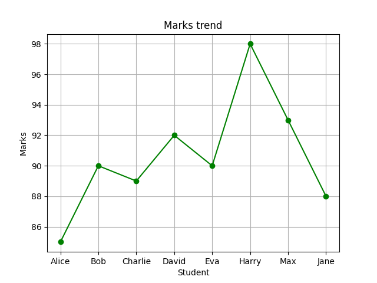
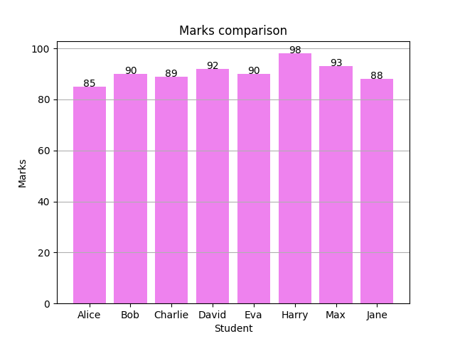
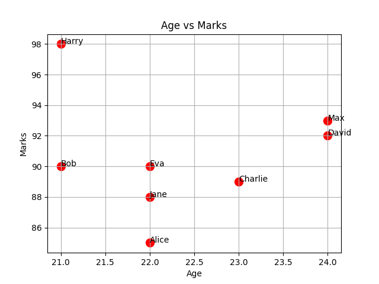

# Student Data Visualization Project

This project analyzes and visualizes student performance data using Python.

## Features

* Data analysis using Pandas
* Line chart for trends
* Bar chart for comparison
* Scatter plot for relationships

## Visualizations

### Marks Trend

### Marks Comparison

### Age vs Marks

## Technologies Used

* Python
* Pandas
* Matplotlib

## Purpose

To demonstrate data analysis and visualization skills using real datasets.
