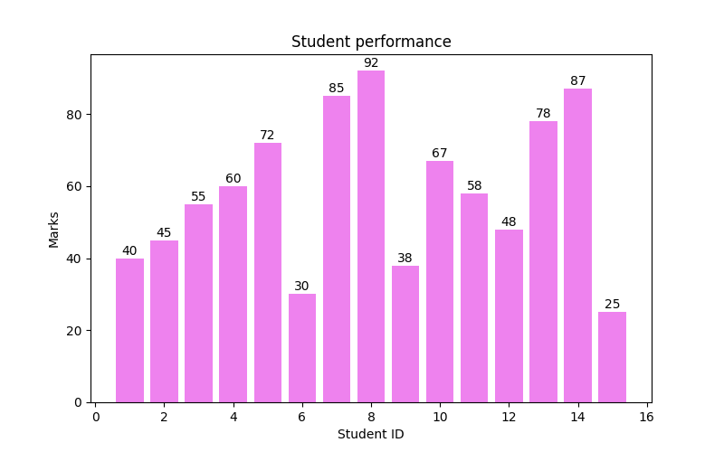
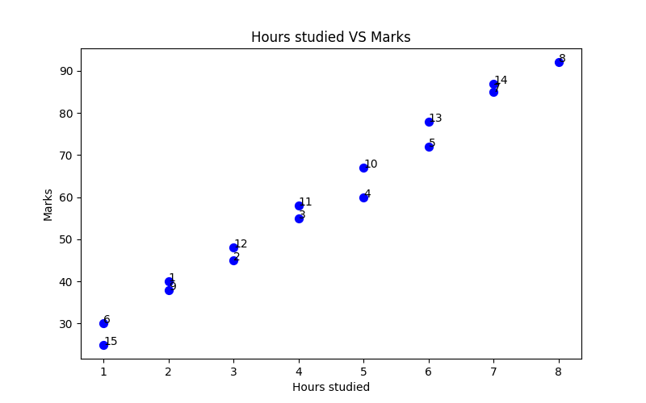
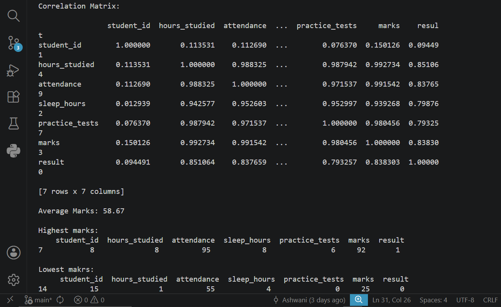
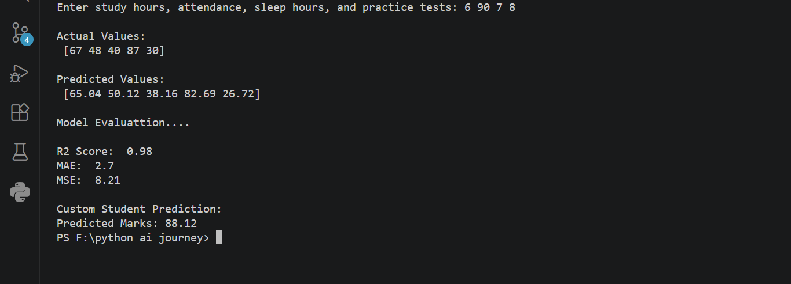

# 🎓 Student Performance Analysis & Prediction System

A beginner Machine Learning project built using **Python, Pandas, Matplotlib, and Scikit-learn** to analyze student performance and predict marks based on study-related factors.

---

# 🚀 Project Overview

This project focuses on:

- Data Analysis
- Data Visualization
- Correlation Analysis
- Linear Regression
- Model Evaluation
- Custom Student Prediction

The system analyzes how factors like:
- study hours
- attendance
- sleep
- practice tests

affect student marks.

---

# 📂 Project Structure

```bash
student_performance_system/
│
├── data/
│   └── student_data.csv
│
├── outputs/
│   ├── scatter_plot.png
│   └── bar_chart.png
│
├── screenshots/
│   ├── analysis_terminal.png
│   └── model_terminal.png
│
├── analysis.py
├── model.py
├── main.py
└── README.md
```

---

# 📊 Dataset Features

| Feature | Description |
|---|---|
| student_id | Unique student ID |
| hours_studied | Daily study hours |
| attendance | Attendance percentage |
| sleep_hours | Average sleep hours |
| practice_tests | Number of practice tests |
| marks | Final marks |
| result | Pass/Fail |

---

# 🧠 Features Implemented

## ✅ Data Analysis
- Dataset loading using Pandas
- Missing value checking
- Duplicate row checking
- Average marks calculation
- Highest and lowest marks analysis

---

## ✅ Correlation Analysis
Used correlation matrix to understand relationships between:
- study hours
- attendance
- sleep hours
- practice tests
- marks

---

## ✅ Data Visualization
Created:
- Scatter Plot
- Bar Chart

using Matplotlib.

---

# 📈 Visual Outputs

## 📊 Student Performance Bar Chart



---

## 📉 Hours Studied vs Marks Scatter Plot



---

# 🤖 Machine Learning Model

Implemented:
- Linear Regression
- Train-Test Split
- Custom User Prediction

using Scikit-learn.

---

# 📌 Model Workflow

```text
Load Dataset
→ Feature Selection
→ Train-Test Split
→ Train Model
→ Predict Marks
→ Evaluate Model
→ Custom Prediction
```

---

# 📊 Model Evaluation Metrics

| Metric | Value |
|---|---|
| R² Score | 0.98 |
| MAE | 2.7 |
| MSE | 8.21 |

---

# 🖥 Terminal Outputs

## 📌 Analysis Output



---

## 📌 Model Prediction Output



---

# 🎯 Custom Prediction Example

Input:
```text
Study Hours: 6
Attendance: 90
Sleep Hours: 7
Practice Tests: 8
```

Predicted Marks:
```text
88.12
```

---

# 🛠 Technologies Used

- Python
- Pandas
- Matplotlib
- Scikit-learn

---

# 🚀 Future Improvements

Planned future additions:
- Logistic Regression
- Classification models
- Better datasets
- Streamlit Web App
- Deployment

---

# 👨‍💻 Author

Ashwani  
CSAI Student | Python & AI Learning Journey